# 驾校预约学习系统 — 数据库实体关系图

本图基于系统数据库结构绘制，展示各业务实体的字段组成及实体间的关联关系。

```mermaid
erDiagram

    USERS {
        bigint id PK "管理员主键"
        varchar50 username "登录用户名"
        varchar100 password "登录密码"
        varchar20 role "角色标识"
        datetime addtime "注册时间"
    }

    USER {
        int id PK "学员主键"
        varchar50 username "登录账号"
        varchar100 password "登录密码"
        varchar50 user_name "真实姓名"
        varchar20 user_phone "手机号码"
        varchar32 user_id_number "身份证号"
        varchar255 user_photo "头像地址"
        int sex_type "性别类型"
        varchar100 user_email "电子邮箱"
        datetime create_time "注册时间"
    }

    COACH {
        int id PK "教练主键"
        varchar50 username "登录账号"
        varchar100 password "登录密码"
        varchar50 name "教练姓名"
        varchar20 phone "手机号码"
        varchar32 id_card "身份证号"
        varchar255 photo "头像地址"
        int sex_type "性别类型"
        varchar100 email "电子邮箱"
        datetime create_time "入职时间"
    }

    COACH_RESERVATION {
        int id PK "预约记录主键"
        varchar32 registration_number "报名流水编号"
        int coach_id FK "关联教练"
        int user_id FK "关联学员"
        longtext reason_text "报名申请说明"
        datetime insert_time "提交预约时间"
        int status "审核状态"
        varchar200 reply_text "审核意见"
        datetime review_time "审核完成时间"
        datetime appointment_time "约定上课时间"
        datetime create_time "记录创建时间"
    }

    NOTICE {
        int id PK "公告主键"
        varchar100 title "公告标题"
        varchar255 image "配图路径"
        int types "公告类别"
        datetime insert_time "发布时间"
        longtext content "公告正文"
        datetime create_time "记录创建时间"
    }

    STUDY_MATERIAL {
        int id PK "资料主键"
        varchar100 material_name "资料名称"
        varchar50 material_number "资料编号"
        varchar255 material_photo "封面图片"
        int good_number "点赞数量"
        int bad_number "踩数量"
        int material_types "资料分类"
        varchar255 material_video "视频文件地址"
        varchar255 file_url "附件下载地址"
        longtext material_content "资料详细介绍"
        int material_delete "逻辑删除标志"
        datetime insert_time "录入时间"
        datetime create_time "记录创建时间"
    }

    MATERIAL_COLLECTION {
        int id PK "收藏记录主键"
        int material_id FK "关联学习资料"
        int user_id FK "关联学员"
        int material_types "收藏资料类型"
        datetime insert_time "收藏时间"
        datetime create_time "记录创建时间"
    }

    MATERIAL_COMMENT {
        int id PK "留言记录主键"
        int material_id FK "关联学习资料"
        int user_id FK "关联学员"
        text content "留言内容"
        datetime insert_time "留言时间"
        text reply_text "管理员回复"
        datetime reply_time "回复时间"
        datetime create_time "记录创建时间"
    }

    MESSAGE_BOARD {
        int id PK "留言板记录主键"
        int user_id FK "关联学员"
        varchar100 title "留言标题"
        text content "留言正文"
        datetime insert_time "留言时间"
        text reply_text "管理员回复"
        datetime reply_time "回复时间"
        datetime create_time "记录创建时间"
    }

    EXAM_PAPER {
        int id PK "试卷主键"
        varchar100 exam_paper_name "试卷名称"
        int duration "考试时长分钟"
        int total_score "试卷满分"
        int subject_type "所属科目"
        int status "试卷启用状态"
        int method "组卷方式"
        tinyint is_delete "逻辑删除标志"
        datetime create_time "创建时间"
    }

    EXAM_QUESTION {
        int id PK "试题主键"
        varchar500 paper_name "试题题干"
        int subject_type "所属科目"
        text question_options "选项JSON数组"
        varchar255 question_answer "标准答案"
        text question_analysis "答案解析"
        int question_type "题目类型"
        int sort "排列权重"
        datetime create_time "创建时间"
    }

    EXAM_PAPER_QUESTION {
        int id PK "组题记录主键"
        int exam_paper_id FK "关联试卷"
        int question_id FK "关联试题"
        int question_score "该题分值"
        datetime create_time "创建时间"
    }

    EXAM_RECORD {
        int id PK "考试记录主键"
        varchar32 examrecord_uuid_number "考试流水编号"
        int user_id FK "关联学员"
        int paper_id FK "关联试卷"
        int total_score "本次所得分数"
        datetime insert_time "考试时间"
        datetime create_time "记录创建时间"
    }

    EXAM_DETAILS {
        int id PK "答题明细主键"
        varchar32 examredetails_uuid_number "所属试卷编号"
        int user_id FK "关联学员"
        int question_id FK "关联试题"
        varchar255 user_answer "考生所选答案"
        int score "本题所得分数"
        datetime create_time "记录创建时间"
    }

    WRONG_QUESTION {
        int id PK "错题记录主键"
        int user_id FK "关联学员"
        int paper_id FK "关联试卷"
        int question_id FK "关联试题"
        varchar255 user_answer "考生错误答案"
        datetime insert_time "记录时间"
        datetime create_time "创建时间"
    }

    TOKEN {
        bigint id PK "令牌主键"
        bigint userid "所属用户ID"
        varchar100 username "所属用户名"
        varchar100 tablename "来源表名"
        varchar100 role "用户角色"
        varchar200 token "令牌字符串"
        timestamp addtime "签发时间"
        timestamp expiratedtime "过期时间"
    }

    CONFIG {
        bigint id PK "配置项主键"
        varchar100 name "配置参数名"
        varchar100 value "配置参数值"
    }

    DICTIONARY {
        bigint id PK "字典项主键"
        varchar50 dic_code "字段标识码"
        varchar100 dic_name "字段显示名"
        int code_index "选项编码值"
        varchar50 index_name "选项显示名"
        int super_id "父级字段ID"
        varchar500 beizhu "备注说明"
        datetime create_time "创建时间"
    }

    %% ── 教练预约关系 ──
    COACH ||--o{ COACH_RESERVATION : "被预约"
    USER ||--o{ COACH_RESERVATION : "发起预约"

    %% ── 学习资料关系 ──
    STUDY_MATERIAL ||--o{ MATERIAL_COLLECTION : "被收藏"
    USER ||--o{ MATERIAL_COLLECTION : "收藏资料"

    STUDY_MATERIAL ||--o{ MATERIAL_COMMENT : "被评论"
    USER ||--o{ MATERIAL_COMMENT : "发表评论"

    %% ── 留言板关系 ──
    USER ||--o{ MESSAGE_BOARD : "发布留言"

    %% ── 试卷组题关系 ──
    EXAM_PAPER ||--o{ EXAM_PAPER_QUESTION : "包含试题"
    EXAM_QUESTION ||--o{ EXAM_PAPER_QUESTION : "被纳入试卷"

    %% ── 考试记录关系 ──
    USER ||--o{ EXAM_RECORD : "参加考试"
    EXAM_PAPER ||--o{ EXAM_RECORD : "生成考试记录"

    %% ── 答题明细关系 ──
    USER ||--o{ EXAM_DETAILS : "作答试题"
    EXAM_QUESTION ||--o{ EXAM_DETAILS : "对应作答明细"

    %% ── 错题本关系 ──
    USER ||--o{ WRONG_QUESTION : "产生错题"
    EXAM_PAPER ||--o{ WRONG_QUESTION : "所属试卷"
    EXAM_QUESTION ||--o{ WRONG_QUESTION : "对应错误试题"
```

## 表说明

| 表名 | 中文含义 | 核心字段说明 |
|------|----------|-------------|
| `users` | 管理员账户 | 系统后台管理员，独立于学员体系 |
| `user` | 学员信息 | 学员基本信息，含身份证、手机唯一校验 |
| `coach` | 教练信息 | 教练档案，含身份证、手机、账号唯一校验 |
| `coach_reservation` | 教练预约 | 学员向教练提交预约申请及审核流程 |
| `notice` | 公告信息 | 驾校发布的通知公告，支持图文 |
| `study_material` | 学习资料 | 驾考相关学习资源，支持视频和附件 |
| `material_collection` | 资料收藏 | 学员对资料的收藏记录 |
| `material_comment` | 资料留言 | 学员对资料的评论及管理员回复 |
| `message_board` | 留言板 | 学员向平台提交的通用留言 |
| `exam_paper` | 试卷 | 驾考模拟试卷，含科目和组卷方式 |
| `exam_question` | 试题库 | 单选/多选题目，含选项JSON和解析 |
| `exam_paper_question` | 试卷组题 | 试卷与题目的多对多关联及分值 |
| `exam_record` | 考试记录 | 学员每次参加模拟考试的成绩汇总 |
| `exam_details` | 答题明细 | 每道题的具体作答内容和得分 |
| `wrong_question` | 错题本 | 学员答错的题目记录，用于复习 |
| `token` | 登录令牌 | 系统认证用的会话令牌管理 |
| `config` | 系统配置 | 键值对形式的系统参数配置 |
| `dictionary` | 数据字典 | 下拉选项、枚举值等通用编码表 |
