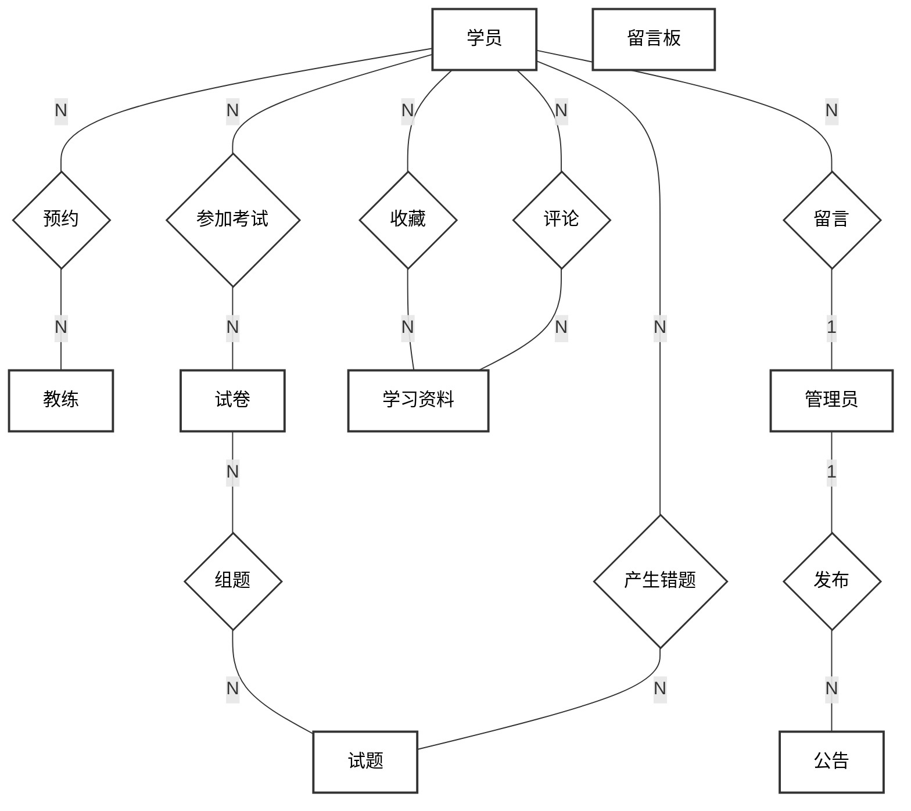
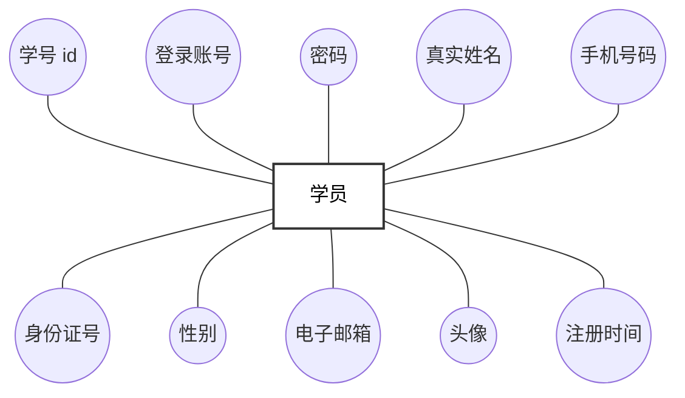
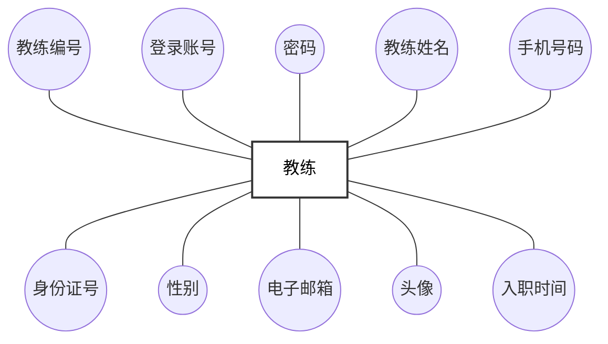
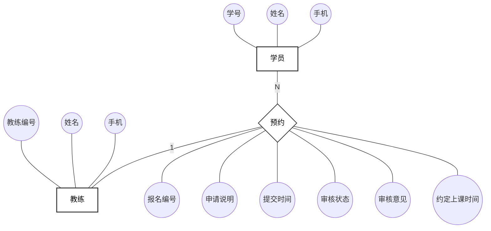
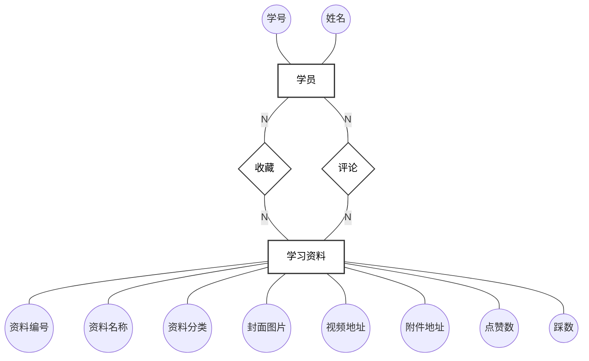
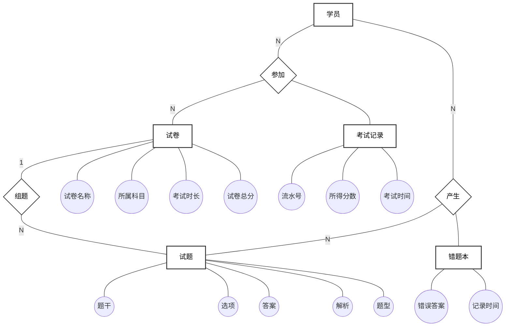
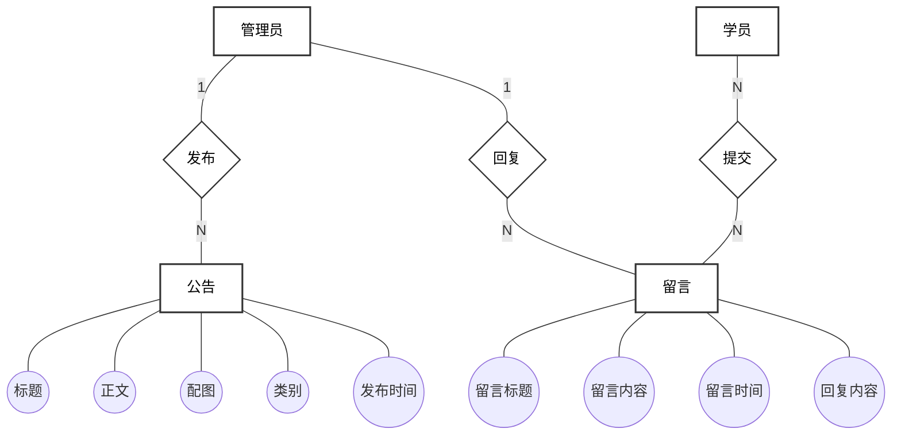

# 驾校预约学习系统 — E-R 图（陈氏表示法）

采用经典 **Chen Notation**：
- **矩形**：实体（Entity）
- **椭圆**：属性（Attribute）
- **菱形**：联系（Relationship）
- 连线上的 **1 / N / M**：表示基数关系

---

## 一、系统总体 E-R 图



---

## 二、学员实体 E-R 图



---

## 三、教练实体 E-R 图



---

## 四、教练预约 E-R 图（学员—预约—教练）



---

## 五、学习资料 E-R 图（学员—收藏/评论—资料）



---

## 六、在线考试 E-R 图（学员—试卷—试题）



---

## 七、公告与留言板 E-R 图



---

## 渲染方式

1. **VS Code**：安装 `Markdown Preview Mermaid Support` 插件，直接预览。
2. **在线渲染**：将每段 ```mermaid``` 代码复制到 [mermaid.live](https://mermaid.live)，导出 PNG / SVG 用于论文插图。
3. **Typora**：默认支持 Mermaid，打开本文件即可看到所有图。
