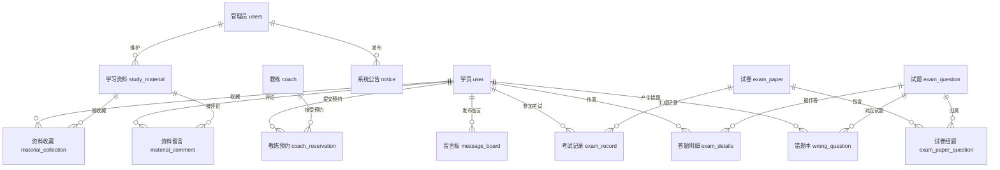

# 驾校预约学习系统 — 简化版 E-R 图

仅展示核心实体与主要关联关系，省略字段细节，用于系统整体结构呈现。

## 核心业务模块

| 业务模块 | 涉及实体 | 关键关系 |
|----------|----------|----------|
| **用户管理** | 管理员 / 学员 / 教练 | 三类角色独立登录 |
| **教练预约** | 学员 ↔ 教练预约 ↔ 教练 | 学员发起、教练审核 |
| **学习资料** | 学员 ↔ 资料 ↔ 收藏 / 留言 | 学员可收藏与评论 |
| **在线考试** | 学员 → 试卷 ← 试题 → 答题明细 / 错题本 | 试卷与试题多对多 |
| **系统辅助** | 公告 / 留言板 | 信息发布与反馈 |

## 主要实体属性概览（精简）

- **学员 USER**：账号、姓名、手机、身份证、性别、邮箱
- **教练 COACH**：账号、姓名、手机、身份证、性别、邮箱
- **管理员 USERS**：用户名、密码、角色
- **教练预约 COACH_RESERVATION**：报名编号、学员、教练、申请说明、审核状态、约定上课时间
- **学习资料 STUDY_MATERIAL**：名称、分类、封面、视频、附件、点赞/踩
- **试卷 EXAM_PAPER**：试卷名、科目、时长、总分、组卷方式
- **试题 EXAM_QUESTION**：题干、选项、答案、解析、题型
- **考试记录 EXAM_RECORD**：流水号、学员、试卷、总分、考试时间
- **错题本 WRONG_QUESTION**：学员、试卷、试题、错误答案、时间
