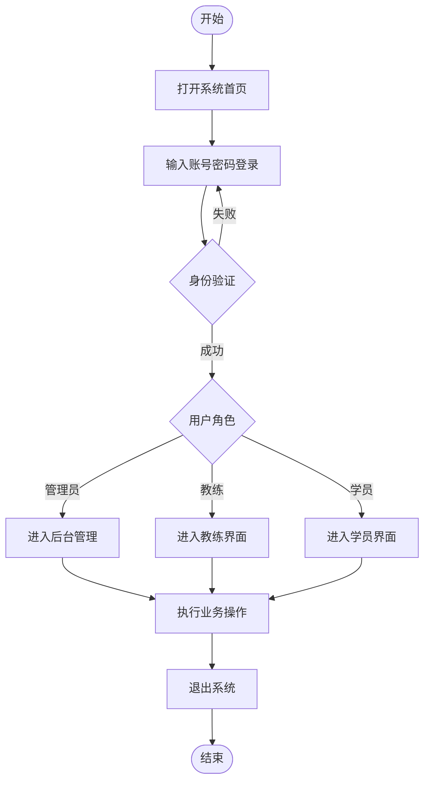
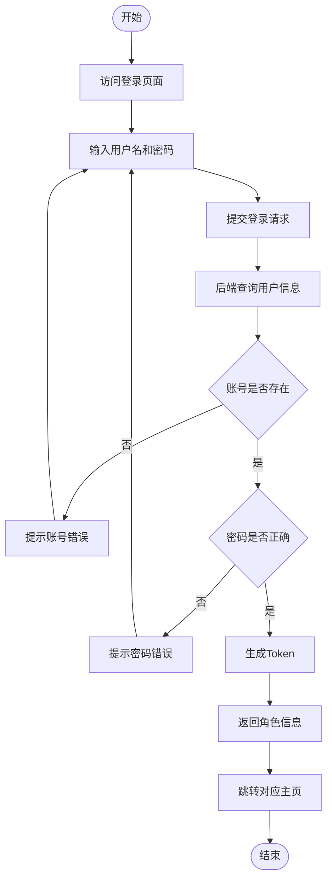
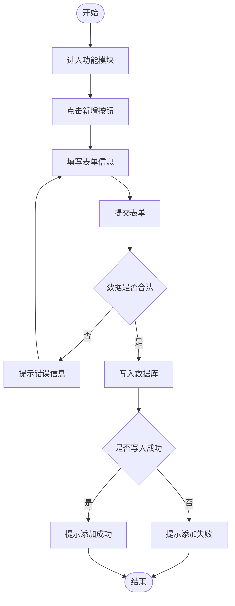
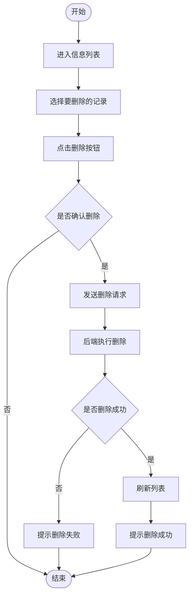

# 驾校预约学习系统 — 业务流程图（精简版）

白底黑字、单线条、自上而下，符合学位论文插图规范。

---

## 一、系统总体操作流程

---

## 二、用户登录流程

---

## 三、添加信息流程

---

## 四、删除信息流程

---

## 渲染建议

打开 [mermaid.live](https://mermaid.live) → 粘贴上方代码 → 顶部菜单 **Config** → 主题选择 **neutral** 或 **default** → 导出 PNG/SVG，即可得到纯白底、黑色线条的图片。
